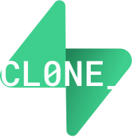
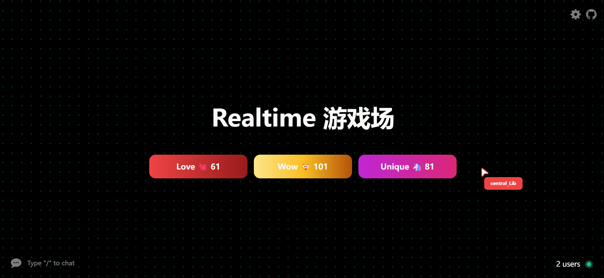
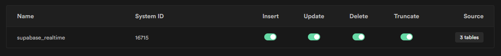
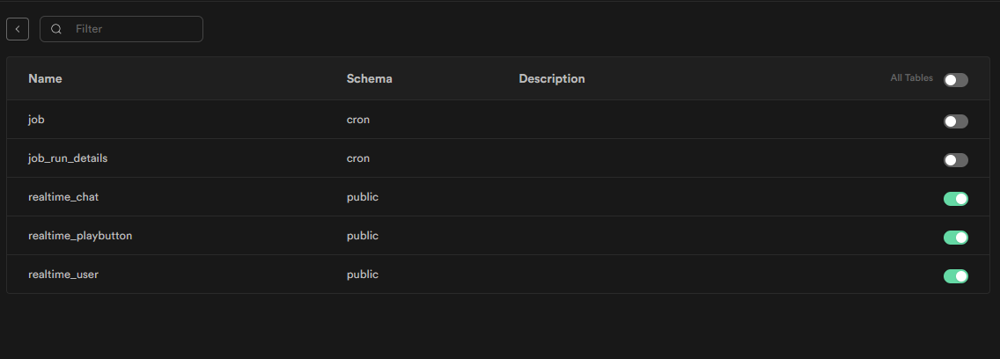
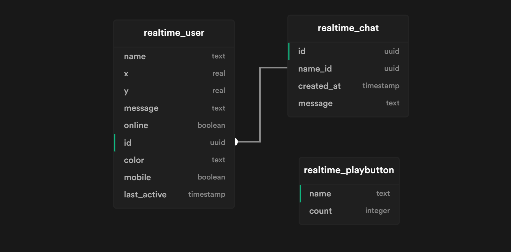

<!-- PROJECT LOGO -->
<br />
<p align="center">
  <a href="https://github.com/zernonia/supabase-realtime-playground">
    
  </a>

  <h3 align="center">Realtime 游乐场</h3>





***

## 🚀 特点

- 🎉 在互联网上与其他用户玩耍
- ⌚ 实时更新光标和按钮计数
- ⛅ 实时聊天


### 🔨 构建

- [Supabase](https://supabase.io/)
- [Supabase Realtime](https://supabase.io/docs/reference/javascript/subscribe)
- [Vue 3](https://v3.vuejs.org/)
- [Vite](https://vitejs.dev/)
- [WindiCSS](https://windicss.org/)


### :warning: Repliation Settings (IMPORTANT)

记得跟着 [Supabase Dashboard Realtime Settings](https://supabase.io/docs/guides/api#managing-realtime) 来启用 **Realtime**, 照此




### Schema



> Generated by [Supabase Schema](https://supabase-schema.vercel.app/)

```sql
-- Schema
-- user table
create table realtime_user (
  id uuid default uuid_generate_v4() primary key,
  name text,
  x real,
  y real,
  message text,
  online boolean,
  color text,
  mobile boolean,
  last_active timestamp default now()
);

-- chat table
create table realtime_chat (
  id uuid default uuid_generate_v4() primary key,
  name_id uuid references realtime_user on delete cascade,
  created_at timestamp default now(),
  message text
);

-- playbutton table
create table realtime_playbutton (
  name text not null primary key,
  count integer
);


-- RLS
-- enable RLS for user table
alter table public.realtime_user enable row level security;

create policy "Enable access to all users" on public.realtime_user for
select using (true);

create policy "Enable insert for all users" on public.realtime_user for
insert with check (true);

create policy "Enable update for all users" on public.realtime_user for
update using (true) with check (true);


-- enable RLS for chat table
alter table public.realtime_chat enable row level security;

create policy "Enable access to all users" on public.realtime_chat for
select using (true);

create policy "Enable insert for all users" on public.realtime_chat for
insert with check (true);


-- enable RLS for play button table
alter table public.realtime_playbutton enable row level security;

create policy "Enable access to all users" on public.realtime_playbutton for
select using (true);

create policy "Enable update for all users" on public.realtime_playbutton for
update using (true) with check (true);


-- Function
-- CRON job as a fallback when frontend failed to detect user closed app or browser
create extension if not exists pg_cron;
grant usage on schema cron to postgres;
grant all privileges on all tables in schema cron to postgres;

select
  cron.schedule(
    'make-inactive-user-offline',
    '* * * * *', -- every minute
    $$
      update public.realtime_user
        set online = false
        where online = true and now() - INTERVAL '1 min' > last_active
    $$
  );

-- play button increment
create or replace function realtime_playbutton_addon(a text)
returns void as
  $$
  begin
    update public.realtime_playbutton
    set count = count + 1 where name = a;
  end;
  $$
language plpgsql;


```

## 将创建应用的apikey和url设置到env.d.ts文件

## 🌎 本地开发

### 先决条件

Yarn

- ```sh
  npm install --global yarn
  ```

### Development

1. Clone the repo
   ```sh
   git clone https://github.com/zernonia/supabase-realtime-playground.git
   ```
2. Install NPM packages
   ```sh
   yarn install
   ```
3. Run Development instance
   ```sh
   yarn dev
   ```

## 🙏 鸣谢

1. [Next Conf](https://nextjs.org/conf) for the inspiration.
2. [Replicache](https://doc.replicache.dev/how-it-works) for studying how to replicate similar effect

## 📜 License

Not Associated with Supabase.

Distributed under the MIT License. See `LICENSE` for more information.


